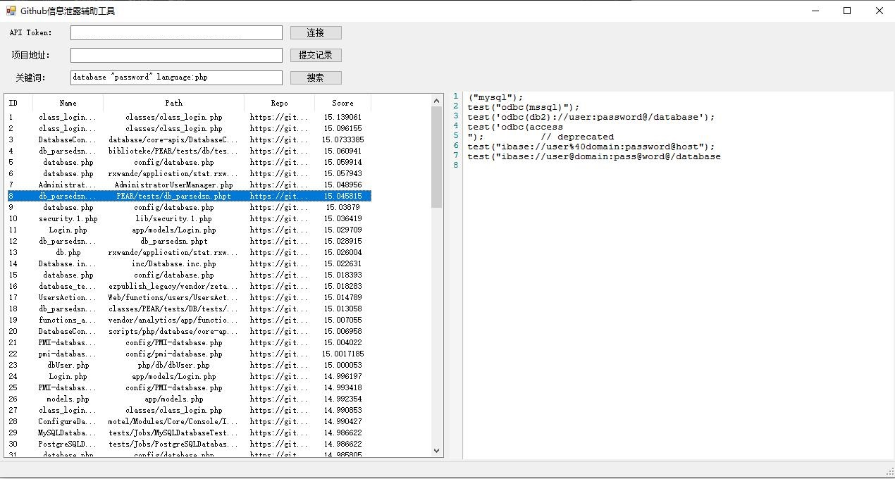

# Github Leaker

现在各式各样的Github信息泄露扫描工具很多，但是有时候过于重量级，需要配合扫描器一起使用，但是很多时候我们只是想验证一下某个Repo的信息，或者想手动进行参数的调整，这时候只能使用Github原生的搜索，比较麻烦，所以就开发了这个小工具

如果有对本工具有意见或建议，欢迎提issus

## 已实现功能

- 使用Github API Token增加调用次数
- 单查项目的提交历史
- 基于关键词进行搜索
- 查看命中内容

## 使用截图

## TODO

- [ ] 增加右键菜单
- [ ] 增加搜索内容高亮
- [ ] 可以选择项目的Branch进行查询
- [ ] 高级搜索辅助工具
- [ ] 结果导出